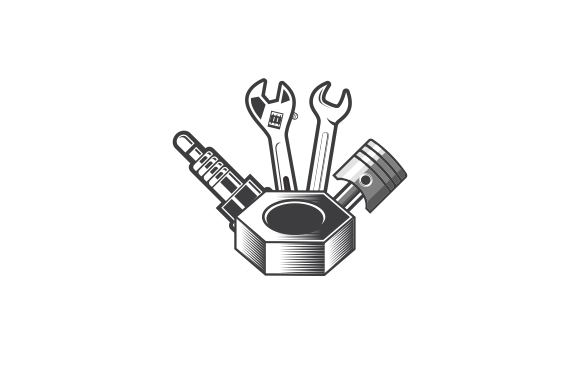
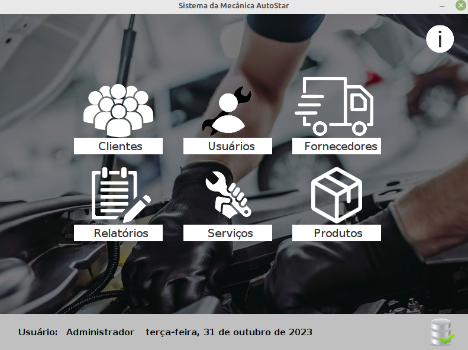

#  AutoStar - Site
## Projeto integrador Senac, com participação do Ryan, Gustavo, João e Nicolas.
 

## Descrição: 
 

<h3>A AutoStar é onde você vai comprar pneus com qualidade no atendimento e muitos outros benefícios exclusivos. Neste conteúdo preparado pelo time da AutoStar, a sua melhor loja e mecânica, você vai entender a função deles e conhecer onde comprar pneus e outros produtos.</h3>

 

## por trás do projeto
 

<H3> Inicialmente, foi necessário configurar uma máquina virtual para hospedar o site, sendo o Linux Server o sistema operacional escolhido para essa finalidade, ultilizamos o Wordpress em conjunto com o Elementor pro para fazer o site. </H3>
 

 

 

## Aplicativo
 
Confira também o nosso Sistema OS, é um sistema para gestão de ordem de serviços e estoque: 
https://github.com/moreiragustavo/AutoStar-SistemaOs/blob/main/SistemaOS-main/README.md
 

 

 

### Nossos Linkedins: 

 

<h1> Ryan </h1>
 

 

<h1> Gustavo </h1>
 

 

<h1> Nicolas </h1>
 

 

<h1> João </h1>
 
