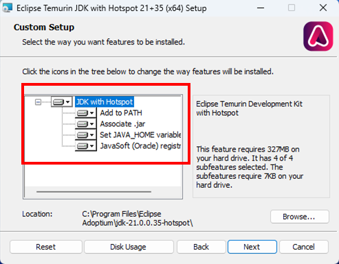
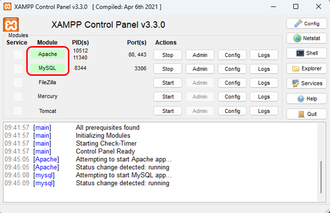
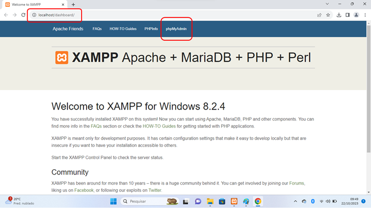
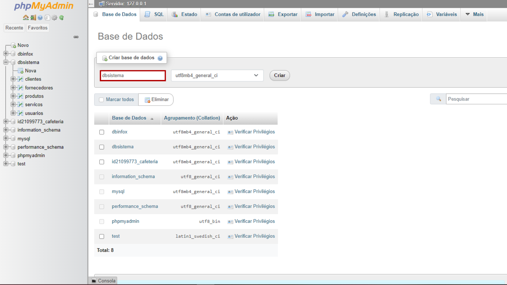
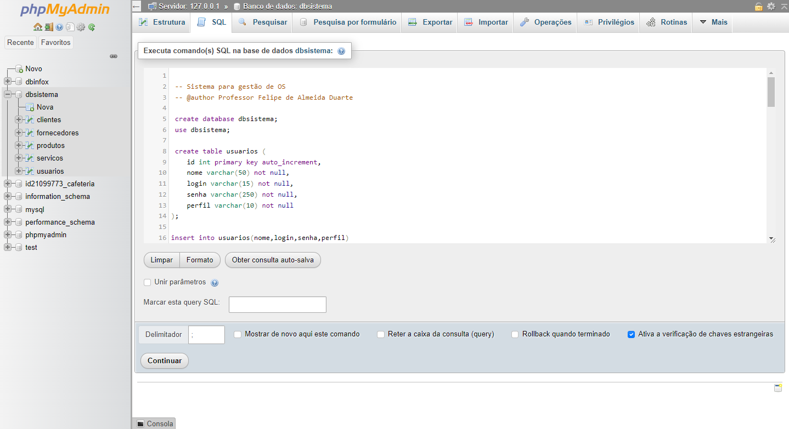
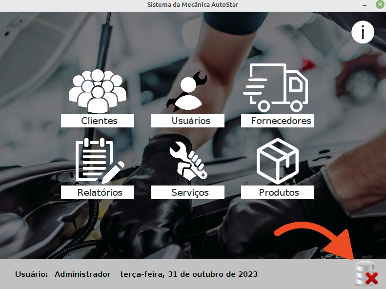
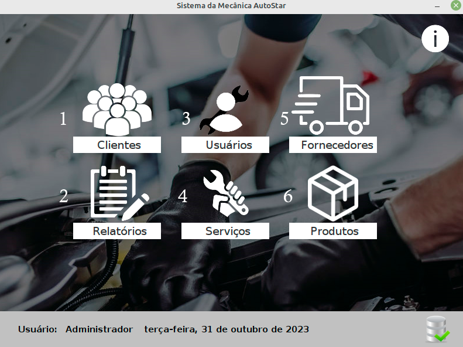

#  AutoStar  - Sistema OS
### Este programa é um sistema para gestão de uma mecanica e loja (**Sistema OS**) de uma mecanica de manutenção de veiculos e loja .  Este projeto é muito popular e serve como modelo para outros projetos de gestão de serviços, como por exemplo lojas de equipamentos automotivos, eletrodomésticos, oficinas mecânicas etc.
 

 

### Autor
Ryan Victor Ferreira Souto

 

## Instruções para instalação e uso do aplicativo
### Pré requisitos:
1) Ter o Java **versão 17** ou superior instalado. Testado com a versão openJDK 21 LTS que pode ser obtida no link indicado. Na instalação selecione todos os recursos conforme indicado na imagem.

[download openJDK)](https://adoptium.net/)

2) Ter um banco de dados local baseado no **MySQL 8** ou MariaDB compatível, no exemplo usei o XAMPP que pode ser obtido no link indicado.

[download xampp](https://www.apachefriends.org/)

### Instalação do banco
1) Iniciar os serviços Apache e MySQL no XAMPP, conforme indicado na imagem.

2) No navegador de internet digite: **localhost/dashboard** e selecione no menu: **phpMyAdmin** conforme indicado na imagem.

3) Crie um novo banco de dados de nome **dbsistema** (sem usar acentuação) conforme indicado na imagem.

4) Acesse o link abaixo e copie o código depois na aba SQL, copie e cole o código abaixo e execute. (Passos 1,2 e 3 indicados na imagem)

https://github.com/moreiragustavo/SistemaOS/blob/main/banco/SistemaOS.sql
 

### Instalação do aplicativo
1) Em Releases faça o download do arquivo **AutoStar**
2) Execute e verifique no rodapé o ícone que representa o banco de dados conectado. Se estiver com erro (conforme indicado na figura) verifique o XAMPP e revise novamente os passos 1 a 4 da instalação do banco.

3) Se tudo estiver OK você pode cadastrar novos usuários (1), fazer uma ordem de serviço (2), cadastrar fornecedores (3), ver a aba de relatórios (4), cadastrar clientes (5) e produtos (6).

## Tecnologias que são abordadas neste projeto:
- Criação de banco de dados e tabelas no MySQL
- CRUD (Create Read Update e Delete)
- IDE Eclipse
- Java SE
- Window Builder
- JDBC (Java Database Connectivity)
- Validação de dados
- Uso da biblioteca iTextpdf para gerar listagem de alunos com foto

 

## Bibliotecas usadas neste projeto
[mysql](https://dev.mysql.com/downloads/connector/j/)

[itextpdf](https://github.com/itext/itextpdf)

 